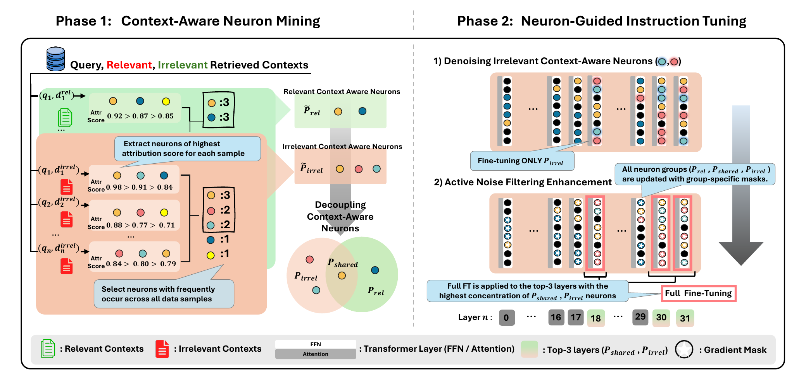

# Where Does Robustness Live? Neuron-Guided Adaptation for Retrieval-Augmented Language Models

This repository contains the implementation of **NeuRIT**, a neuron-guided
instruction-tuning framework for improving the robustness of retrieval-augmented
language models (RALMs) against irrelevant or noisy retrieved contexts.

<p align="center">
  <a href="https://arxiv.org/abs/2604.02194"><strong>Paper</strong></a>
  &nbsp;|&nbsp;
  <a href="https://github.com/Jaemin0730/NeuRIT"><strong>Code</strong></a>
  &nbsp;|&nbsp;
  <a href="https://huggingface.co/Jaemin0730/NeuRIT"><strong>Model</strong></a>
</p>

## Overview

<p align="center">
  
</p>

<p align="center">
  <em>Overview of NeuRIT: context-aware neuron mining followed by two-stage neuron-guided instruction tuning.</em>
</p>

Retrieved documents often include content that is irrelevant to a query and can
mislead the generator. NeuRIT addresses this problem at neuron-level
granularity instead of densely adapting an entire model or module.

The framework consists of two phases:

1. **Context-aware neuron mining.** We use Integrated Gradients to measure the
   contribution of FFN neurons when the model processes relevant and irrelevant
   contexts. The mined neurons are separated into relevant-only
   (`P_rel`), irrelevant-only (`P_irrel`), and shared (`P_shared`) groups.
2. **Neuron-guided instruction tuning.** We first denoise `P_irrel` by training
   it toward an End-of-Text (EOT) output. We then enhance noise filtering using
   group-specific gradient masks and full fine-tuning of the layers with the
   highest density of irrelevant/shared neurons.

The resulting generator is trained to suppress retrieval noise, distill relevant
evidence, and answer a question using the distilled information.

## Implementation Details

All experiments in the paper use
[`meta-llama/Meta-Llama-3-8B-Instruct`](https://huggingface.co/meta-llama/Meta-Llama-3-8B-Instruct)
as the generator and are conducted on a single NVIDIA H200 GPU with 141 GB of
memory. Context-aware neurons are identified using approximately 400 samples
from the HotpotQA training set. We set the occurrence-frequency threshold to
130, resulting in 100 relevant neurons (`P_rel`), 100 irrelevant neurons
(`P_irrel`), and 30 shared neurons (`P_shared`).

Relevant-summary supervision is generated using GPT-4.1 mini. Each summary is
limited to 142 tokens and is prompted to use only the information contained in
the provided documents, without relying on the model's intrinsic knowledge.

Both instruction-tuning stages use the AdamW optimizer and a batch size of 4.
The irrelevant-neuron denoising stage is trained for one epoch with a learning
rate of `1e-5`. The noise-filtering enhancement stage is trained for two epochs
with a learning rate of `2e-5`.

## Method

### Phase 1: Context-Aware Neuron Mining

For each query, we construct a relevant-context example and an
irrelevant-context example. Given a context type
`c in {relevant, irrelevant}`, NeuRIT computes an attribution score for each
FFN neuron by integrating the gradient between the query-only activation and the
query-with-context activation.

For each sample, the implementation retains the highest-attribution neurons and
aggregates their occurrence across samples. Candidate sets mined from the two
context types are then decoupled as follows:

```text
P_shared = P_rel_candidate ∩ P_irrel_candidate
P_rel    = P_rel_candidate   - P_shared
P_irrel  = P_irrel_candidate - P_shared
```

In the paper configuration, we use 20 integration steps, select the top 20
neurons per sample after attribution filtering, and finally retain 100 relevant,
100 irrelevant, and 30 shared neurons.

### Phase 2: Neuron-Guided Instruction Tuning

NeuRIT performs two consecutive tuning stages:

#### Stage 1: Irrelevant-neuron denoising

Only the parameters associated with `P_irrel` are selected through a gradient
mask. They are instruction-tuned to emit an EOT token, functionally suppressing
neurons associated exclusively with irrelevant contexts.

#### Stage 2: Noise-filtering enhancement

The model is trained on relevant-summary supervision: given a query and a set of
potentially noisy documents, it generates a summary containing only evidence
relevant to the query. Gradient masks selectively update `P_rel`, `P_irrel`, and
`P_shared`, while the layers with the highest concentration of irrelevant/shared
neurons are fully tuned. For Llama-3-8B-Instruct in the paper, these are the last
three layers (29, 30, and 31).

At inference time, a dual instruction asks the model to extract relevant evidence
from the retrieved documents and then answer the question concisely.

## Repository Structure

```text
NeuRIT/
├── Phase1/
│   └── src/
│       ├── 1_calculate_attribution_topbottom.py
│       ├── 2_get_cns_topbottom.py
│       ├── 3_enhance_and_evaluate_topbottom.py
│       └── *_run_*.sh
├── Phase2/
│   ├── make_pt_all_edit_Denoise.py
│   ├── make_pt_all_edit_NoiseFilter.py
│   ├── train_neuron-Denoise/
│   └── train_neuron-NoiseFilter/
└── env/
    ├── phase1.yaml
    └── phase2.yaml
```

## Getting Started

### Requirements

The experiments use Python 3.10, PyTorch, CUDA, and Hugging Face Transformers.
Separate Conda environments are provided for neuron mining and neuron-guided
instruction tuning:

```bash
# Phase 1: context-aware neuron mining (PyTorch 2.6.0 / CUDA 12.4)
conda env create -f env/phase1.yaml
conda activate phase1

# Phase 2: neuron-guided instruction tuning (PyTorch 2.3.1 / CUDA 12.1)
conda env create -f env/phase2.yaml
conda activate phase2
```

You also need access to the base generator used in the paper:
[`meta-llama/Meta-Llama-3-8B-Instruct`](https://huggingface.co/meta-llama/Meta-Llama-3-8B-Instruct).

### Data Preparation

Prepare paired attribution data for the two context types:

```text
Phase1/data/
├── relevant.jsonl       # query + relevant retrieved context
└── irrelevant.jsonl     # query + irrelevant retrieved context
```

Each record should contain the query, retrieved context, and target answer in the
format expected by `1_calculate_attribution_topbottom.py`.

The paper uses approximately 400 HotpotQA training samples for neuron mining.

For Phase 2, prepare:

- an EOT-supervision dataset for irrelevant-neuron denoising; and
- a relevant-summary dataset for noise-filtering enhancement.

## Running NeuRIT

All Phase 1 commands below are run from `Phase1/`.

### 1. Compute Neuron Attributions

Run attribution for the two context groups on separate GPUs:

```bash
cd Phase1

CUDA_VISIBLE_DEVICES=0 bash src/1_run_calculate_top_llama3-8b.sh
CUDA_VISIBLE_DEVICES=1 bash src/1_run_calculate_bottom_llama3-8b.sh
```

### 2. Decouple Context-Aware Neurons

Aggregate the sample-level attribution results and split the candidate neurons
into relevant-only, irrelevant-only, and shared groups.

```bash
CUDA_VISIBLE_DEVICES=0 bash src/2_run_get_cns_topbottom_llama3-8b.sh
```

This step writes JSON files containing the decoupled neuron groups under
`Phase1/results/cn/`.

### 3. Run Neuron Enhancement and Evaluation

Run the Phase 1 neuron intervention and evaluation script:

```bash
CUDA_VISIBLE_DEVICES=0 bash src/3_run_train_topbottom_llama3-8b.sh
```

### 4. Build Gradient Masks

Create neuron-level gradient masks for the two instruction-tuning stages.
`make_pt_all_edit_Denoise.py` creates the mask used to update the irrelevant
neurons during denoising, while `make_pt_all_edit_NoiseFilter.py` creates the
mask used for the subsequent noise-filtering stage.

```bash
cd Phase2

# Stage 1: P_irrel only
python make_pt_all_edit_Denoise.py
mv sft_neuron_mask.pt train_neuron-Denoise/

# Stage 2: P_rel, P_irrel, and P_shared
python make_pt_all_edit_NoiseFilter.py
mv sft_neuron_mask.pt train_neuron-NoiseFilter/
```

### 5. Stage 1 — Denoise Irrelevant Neurons

```bash
cd Phase2/train_neuron-Denoise

python3 train_sft.py \
  --model_name_or_path meta-llama/Meta-Llama-3-8B-Instruct \
  --train_file_path ./data/train.jsonl \
  --validate_file_path ./data/dev.jsonl \
  --do_train \
  --output_dir ./output/llama_ul \
  --overwrite_output_dir \
  --num_train_epochs 1 \
  --learning_rate 1e-5 \
  --logging_steps 5 \
  --per_device_train_batch_size 4 \
  --optim adamw_torch \
  --save_only_model True \
  --save_strategy no
```

### 6. Stage 2 — Enhance Noise Filtering

Initialize Stage 2 from the Stage 1 checkpoint and train on relevant summaries.

```bash
cd Phase2/train_neuron-NoiseFilter

python3 train_sft.py \
  --model_name_or_path /root/jaemin/llama_ul \
  --train_file_path ./data/train.jsonl \
  --validate_file_path ./data/dev.jsonl \
  --do_train \
  --output_dir ./output/llama_sft \
  --overwrite_output_dir \
  --num_train_epochs 2 \
  --learning_rate 2e-5 \
  --logging_steps 5 \
  --per_device_train_batch_size 4 \
  --optim adamw_torch \
  --save_only_model True \
  --save_strategy no
```

Replace `/root/jaemin/llama_ul` with the path to the checkpoint produced by the
denoising stage when running in a different environment.

## Evaluation

NeuRIT is evaluated on open-domain and multi-hop QA benchmarks, including
KILT-NQ, ASQA, KILT-TriviaQA, SCIQ, PopQA, KILT-HotpotQA, and 2WikiMultiHopQA.
For the evaluation setup and implementation, please refer to
[BERGEN: A Benchmarking Library for Retrieval-Augmented Generation](https://github.com/naver/bergen).
We use SPLADE-v3 as the retriever and evaluate the fine-tuned generator on each
development split. Run the following commands from the BERGEN repository after
using the `NeuRIT` generator configuration for the released
[`Jaemin0730/NeuRIT`](https://huggingface.co/Jaemin0730/NeuRIT) model:

```bash
CUDA_VISIBLE_DEVICES=0 python3 bergen.py retriever="splade-v3" generator="NeuRIT" dataset="kilt_nq" +dataset_split=dev

CUDA_VISIBLE_DEVICES=0 python3 bergen.py retriever="splade-v3" generator="NeuRIT" dataset="kilt_hotpotqa" +dataset_split=dev

CUDA_VISIBLE_DEVICES=0 python3 bergen.py retriever="splade-v3" generator="NeuRIT" dataset="asqa" +dataset_split=dev

CUDA_VISIBLE_DEVICES=0 python3 bergen.py retriever="splade-v3" generator="NeuRIT" dataset="sciq" +dataset_split=dev

CUDA_VISIBLE_DEVICES=0 python3 bergen.py retriever="splade-v3" generator="NeuRIT" dataset="popqa" +dataset_split=dev

CUDA_VISIBLE_DEVICES=0 python3 bergen.py retriever="splade-v3" generator="NeuRIT" dataset="2wikimultihopqa" +dataset_split=dev

CUDA_VISIBLE_DEVICES=0 python3 bergen.py retriever="splade-v3" generator="NeuRIT" dataset="kilt_triviaqa" +dataset_split=dev
```

## Citation

If you find this repository useful, please cite our paper:

```bibtex
@misc{kim2026neuroritneuronguidedinstructiontuning,
      title={Neuro-RIT: Neuron-Guided Instruction Tuning for Robust Retrieval-Augmented Language Model}, 
      author={Jaemin Kim and Jae O Lee and Sumyeong Ahn and Seo Yeon Park},
      year={2026},
      eprint={2604.02194},
      archivePrefix={arXiv},
      primaryClass={cs.CL},
      url={https://arxiv.org/abs/2604.02194}, 
}
```
